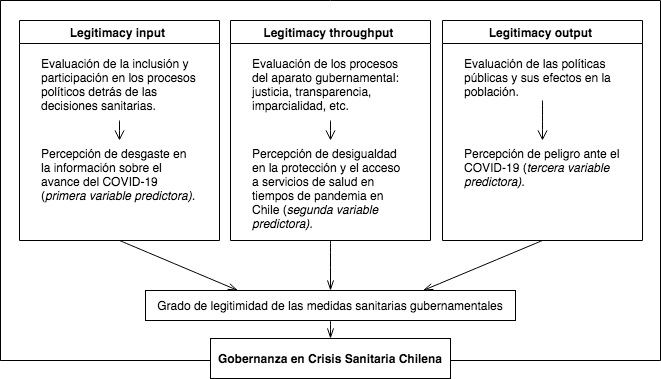
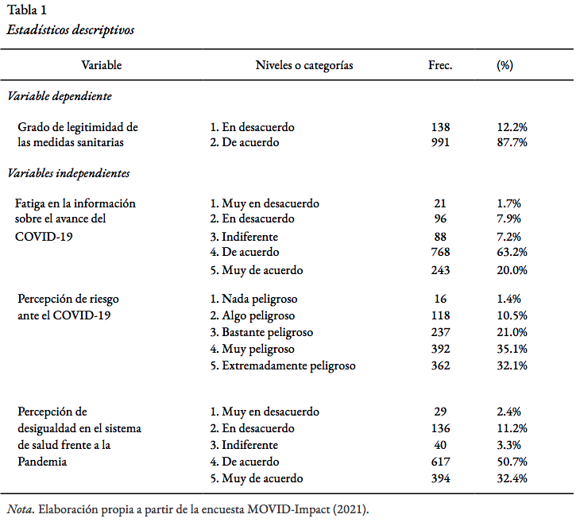

```{r setup, include=FALSE}
knitr::opts_chunk$set(comment=NA, prompt=FALSE, cache=FALSE, echo=TRUE, results='asis', message = F, warning = F)
```

```{r load, echo = F}
# 1. Cargar librarias
# install.packages("pacman")
# library(pacman)
pacman::p_load(dplyr, stargazer, summarytools, kableExtra,
               sjmisc, sjPlot, sjlabelled, ggpubr, gridExtra, webshot,
               corrplot, texreg, ggmosaic, finalfit,
               DescTools)
# remotes::install_github("leifeld/texreg")

# 2. Cargar base de datos
rm(list = ls())
options(scipen=999)
load("input/data/proc/proc_movid.RData")
```

\newpage
# Resumen {-}
Frente al problema público de la influencia de la participación social en la aplicación de políticas sanitarias, y la importancia de la cooperación ciudadana particularmente en la pandemia de COVID-19 [@world_health_organization_covid-19_2020], se busca explicar el grado de acuerdo de los sujetos con las medidas sanitarias adoptadas por el Gobierno a través de la aplicación de modelos de regresión múltiple. En este sentido, se propone determinar el efecto de la constancia en la información sobre el avance del COVID-19, la percepción de desigualdad frente a la pandemia y la percepción de peligro ante el COVID-19, en el grado de legitimidad que los sujetos le adjudican a las medidas sanitarias adoptadas por el Gobierno. 
Para ello se utilizan los datos de la encuesta transversal a hogares MOVID-Impact, realizada por el Centro UC de Encuestas y Estudios Longitudinales por encargo del proyecto académico CoV-IMPACT-C, liderado por la Universidad de Chile. La base de datos cuenta con 1216 casos tras el tratamiento de casos perdidos. 
Los resultados a partir de modelos de regresión múltiple y logística, dan cuenta de que las personas que perciben algún nivel de riesgo ante el coronavirus legitimarían en mayor grado las medidas sanitarias adoptadas por el Gobierno, que aquellas personas que estiman como “Nada peligroso” la enfermedad provocada por el COVID-19. En cuanto a las hipótesis sobre el efecto en la variable dependiente de la constancia en la información sobre el avance del COVID-19 y la percepción de desigualdad frente a la pandemia, los resultados no son estadísticamente significativos.

\newpage
# Introducción
La pandemia de COVID-19 ha puesto de manifiesto la fragilidad de los servicios de salud y los sistemas de salud pública en todo el mundo. Distintos gobiernos han debido tomar medidas sanitarias extraordinarias, y en Chile se ha optado por la implementación de cuarentenas parciales y totales, entre otras medidas. En este contexto, la OMS señala la importancia de la colaboración de las personas para un funcionamiento eficaz de las medidas sanitarias adoptadas [@world_health_organization_covid-19_2020]. El desconocimiento respecto a esta pandemia dejó en evidencia que, en un comienzo, en realidad ningún gobierno sabía realmente cuál era la forma más óptima de enfrentar esta crisis sanitaria. Hoy en día contamos con evidencia empírica de distintos países que lograron enfrentar efectivamente la propagación de la pandemia como son los casos de China y Noruega. La principal lección aprendida del caso noruego es que, a pesar de la falta de preparación en algunos aspectos, el gobierno logró controlar la pandemia con bastante rapidez y eficacia bajo un estilo de toma de decisiones colaborativa, una estrategia de comunicación efectiva, muchos recursos y un alto nivel de confianza de los ciudadanos con el gobierno [@christensen_comparing_2021]. De la misma forma, para el caso de China, el desempeño de la gestión de crisis durante los procesos de manejo de virus está relacionado con la relación dinámica entre la capacidad de gobernanza, para coordinar, analizar, regular y entregar, y la legitimidad del gobierno [@christensen_balancing_2020]. En este ámbito, la principal enseñanza que muestran ambos casos resalta que la legitimidad de gobernanza de las instituciones desde las cuales emanan dichas medidas sanitarias posee gran relevancia, pues esta constituye un factor fundamental en las expectativas y apoyo hacia la gestión llevada a cabo por las autoridades. Una muestra de ello es que las nuevas normas sobre medidas de lockdown, uso de implementos de protección y herramientas de trazabilidad que dependen de la participación voluntaria de las personas han sido más fáciles de implementar en contextos de mayor confianza en las instituciones y las políticas [@oecd_changing_2015 @linn_fleischer_why_2020]. La estrategia de comunicación que se ha usado en Chile se denominó bajo el programa “Paso a Paso”, para el cual diariamente mediante conferencias de prensa y las redes sociales del Ministerio de Salud, se comunica el reporte de la situación del país mediante voceros del mismo ministerio.

El término de legitimidad de la gobernanza se relaciona con el grado de apoyo cultural a una organización [@christensen_comparing_2021], en nuestro caso a la gestión de crisis. Esta se ocupa principalmente de la relación entre el gobierno y los ciudadanos, entendiéndose como la percepción de les ciudadanes de si las acciones de las autoridades se consideran apropiadas dentro de ciertos sistemas de normas, creencias y valores construidos social y culturalmente. Una forma de abordar el tema de la legitimidad gubernamental la conceptualiza a partir de tres dimensiones: input, throughput y output legitimacy (Scharpf, 1999; Schmidt, 2013, citado en Christensen, T., y Ma, L., 2021). La _legitimacy input_ refleja el grado en que los ciudadanos apoyan los procesos políticos y los partidos, así como cómo ven la calidad de su propia participación. La _legitimacy throughput_ se ocupa de los procesos dentro del aparato gubernamental y de cuán abiertos, justos e imparciales se ven. Dentro de este apartado se manifiesta la confianza como un elemento fundamental en el desarrollo de políticas públicas en tiempos de pandemia [@khemani_opportunity_2020]. La _legitimacy output_ se ocupa de las políticas, los medios, las medidas y el desempeño que surgen del aparato público y se dirigen hacia la sociedad, y cómo son percibidos por los ciudadanos.

En virtud de este esquema, resulta de sumo interés analizar el efecto que algunos factores, correspondientes a las tres dimensiones de legitimidad mencionadas, tienen con la legitimidad global respecto a las medidas sanitarias gubernamentales. En primer lugar, relacionar la fatiga en la información sobre los avances del coronavirus, respecto al grado de legitimidad que se tiene sobre las medidas sanitarias del gobierno, considerando que la valoración positiva de la participación en los procesos políticos ( _input legitimacy_ ) está relacionada con el acceso oportuno de la población a la información contingente. En segundo lugar, se propone analizar los efectos de la percepción de desigualdad en la protección y el acceso a servicios de salud en tiempos de pandemia en Chile respecto al grado de legitimidad que se tiene sobre las medidas sanitarias del gobierno. Esto bajo la lógica de que esta percepción de desigualdad se vincula con la _throughout legitimacy_ en términos de confianza en los procesos del aparato gubernamental. En tercer lugar, es de interés analizar el efecto de la percepción de riesgo que las personas tienen sobre el COVID-19 respecto al grado de legitimidad que le adjudican a las medidas sanitarias del gobierno. Esto último se relaciona con la dimensión de _output legitimacy_, en tanto permite evaluar el impacto de las estrategias del gobierno en la dimensión subjetiva del riesgo percibido.

```{r fig1, echo = F, fig.cap="Modelo de _input-throughput-output legitimacy_ aplicado a la Gobernanza en Crisis Sanitaria. Fuente: Elaboración propia."}

```

En adición a lo anteriormente presentado, el impacto del sexo y la edad en las consecuencias sociales y económicas de la Pandemia también ha sido ampliamente estudiado. Estudios señalan que los efectos en el trabajo remunerado y en las labores reproductivas han sido mayores para las mujeres [@blanca_borquez_organizacion_2021], así como las medidas sanitarias más estrictas han aumentado la violencia de género en sus distintas manifestaciones [@moreno-estupinan_violencia_2020]. Asimismo, el riesgo a la salud que implica el COVID-19 aumenta en las personas mayores [@romero_starke_age-related_2020], mientras que la caída en la ocupación laboral ha sido mayor en las personas más jóvenes, lo que podría influir en una percepción diferenciada de los efectos de las medidas sanitarias por grupo etario.


\newpage

# Objetivos e hipótesis
El objetivo general que guía la investigación es analizar el efecto de la fatiga en la información sobre el avance del COVID-19, la percepción de desigualdad en el sistema de salud frente a la Pandemia y la percepción de riesgo ante el COVID-19, en la legitimidad de las medidas sanitarias gubernamentales.

Se proponen las siguientes hipótesis:
$H_1$ Manteniendo el resto de las variables constantes, mientras más fatiga perciba una persona respecto a su información sobre los avances del coronavirus y sus efectos, menor será el grado de acuerdo con las medidas sanitarias adoptadas por el Gobierno.
$H_2$ Ceteris paribus, las personas que perciben menores grados de desigualdad en el acceso a protección y salud frente a la pandemia estarán más de acuerdo con las medidas sanitarias adoptadas por el Gobierno.
$H_3$ Las personas que estiman un bajo nivel de riesgo ante el coronavirus estarán más de acuerdo con las medidas sanitarias adoptadas por el Gobierno, que aquellas personas que estiman un alto nivel de riesgo.

# Metodología

El presente informe trabajó con la base de datos MOVID-IMPACT, que está hecha a partir de la encuesta Movid-Impact producida por el equipo CoV-IMPACT (ANID N°960). Esta encuesta busca dar cuenta de una evaluación transdisciplinaria de las respuestas a la pandemia del COVID-19 y sus consecuencias. La base cuenta con un total de 3569 casos y 168 variables para poder responder a las múltiples dimensiones de la crisis económica y social provocada por la pandemia. Al tomar en cuenta la información de les 1261 encuestades que respondieron a la encuesta, eliminando los casos perdidos respecto a las variables elegidas, se trabajó con un total de 1216 casos.

Para este informe se hizo uso de la siguiente variable dependiente para los modelos de regresión logística:
+ Legitimidad de las medidas sanitarias: Refiere al grado de legitimidad de las medidas sanitarias propuestas por las autoridades sanitarias expresada como variable dicotómica. Fue construida a partir del ítem del cuestionario: “Aunque a veces no estemos de acuerdo con las autoridades sanitarias y las medidas que se proponen, es nuestro deber seguir sus indicaciones al pie de la letra”. En esta variable se agruparon las categorías de “Muy en desacuerdo”, “En desacuerdo” e “Indiferente” en el valor [0] “No de acuerdo” y las categorías en el “De acuerdo” y “Muy de acuerdo” en el valor [1] “De acuerdo”.

Como variables predictoras para los modelos de regresión se consideró:
+ Fatiga en la información sobre el avance del COVID-19: Construida en base a la afirmación “Me informo constantemente sobre los avances del coronavirus y sus efectos en Chile.”. Esta variable incluye cinco categorías, considerando como casos perdidos a las categorías “no sabe” y “no responde”. El valor [1] corresponde a “Muy en desacuerdo”, el valor [2] “En desacuerdo”, el valor [3] “Indiferente”, el valor [4] “De acuerdo”, el valor [5] “Muy de acuerdo”.
+ Percepción de desigualdad en el sistema de salud frente a la Pandemia: Esta variable refiere a la percepción que tienen les encuestades sobre la desigualdad en el acceso a protección y salud frente a la pandemia. Fue construida en base a la afirmación “En Chile hay enormes desigualdades frente a la pandemia: algunas personas están mucho más protegidas y tienen mucho mejor acceso a salud que otras”. Esta variable incluye cinco categorías, considerando como casos perdidos a las categorías “no sabe” y “no responde”. El valor [1] corresponde a “Muy en desacuerdo”, el valor [2] “En desacuerdo”, el valor [3] “Indiferente”, el valor [4] “De acuerdo”, el valor [5] “Muy de acuerdo”.
+ Percepción de riesgo ante el COVID-19: Esta variable refiere a la percepción de riesgo de les encuestades ante el COVID-19. Esta variable incluye cinco categorías, considerando como casos perdidos a las categorías “no sabe” y “no responde”. El valor [1] que es “Nada peligroso”, el valor [2] “Algo peligroso”, el valor [3] “Bastante peligroso”, el valor [4] “Muy peligroso” y el valor [5] “Extremadamente peligroso”. La categoría “Nada peligroso” [1] fue elegida como categoría de referencia en este caso.

Como variables de control:
+ Sexo: Esta variable da cuenta del sexo de la persona bajo las dos opciones “Hombre” [0] y “Mujer” [1]. Se usará de referencia la categoría de “Hombre” [0].
+ Edad: Esta variable da cuenta de la edad del entrevistado en años.

\newpage

# Análisis
## Análisis descriptivo

```{r tab1, echo = F }
# se seleccionan y ordenan los datos extraidos de la tabla en el archivo de analisis exploratorio
 
```

En la Tabla 1 se pueden observar los estadísticos descriptivos principales de cada una de las variables a utilizar. En primer lugar, la mayor parte de la muestra se posiciona en grados de mayor legitimidad de las medidas sanitarias adoptadas por las autoridades sanitarias, pues la variable presenta un 87.7% de la muestra concentrada en “De acuerdo”.

Igualmente, respecto a la variable _Fatiga en la información sobre el avance del COVID-19_, conviene señalar que la mayor parte de la muestra se concentra en las categorías de “De acuerdo” (63.2%) y “Muy de acuerdo” (20.0%). Una distribución similar de los datos se puede observar en la variable percepción de desigualdad frente a la Pandemia, con un 50.7% en la categoría “De acuerdo” y un 32.4% en “Muy de acuerdo”.

En tercer lugar, en cuanto a la variable _Percepción de riesgo ante el COVID-19_, existe una alta dispersión en cuanto a sus resultados, pero que se concentra en las categorías de peligro más altas. La categoría que concentra la mayor cantidad de los resultados corresponde a aquellas que perciben el COVID-19 como “Muy peligroso” (35.1%). A esta categoría le siguen las de “Extremadamente peligroso” (32.1%) y “Bastante peligroso” (21.0%). En menor medida se encuentran las categorías “Algo peligroso” (10.5%) y “Nada peligroso” (1.4%).


## Análisis de regresión

```{r factorizar, echo = FALSE}
proc_movid$sexo<- as_factor(proc_movid$sexo)
proc_movid$peligro_p<- as_factor(proc_movid$peligro_p)
proc_movid$informacion<- as_factor(proc_movid$informacion)
proc_movid$desigualdad_p<- as_factor(proc_movid$desigualdad_p)
```

```{r modelos, echo=FALSE}
# Calcular modelos
m00 <- glm(legitimidad~1,data = proc_movid,family = "binomial")
m01 <- glm(legitimidad~sexo+edad,data = proc_movid,family = "binomial")
m02 <- glm(legitimidad~sexo+edad+peligro_p, data = proc_movid,family = "binomial")
m03 <- glm(legitimidad~sexo+edad+desigualdad_p, data = proc_movid,family = "binomial")
m04 <- glm(legitimidad~sexo+edad+informacion, data = proc_movid,family = "binomial")
m05 <- glm(legitimidad~sexo+edad+peligro_p+desigualdad_p, data = proc_movid,family = "binomial")
m06 <- glm(legitimidad~sexo+edad+peligro_p+informacion, data = proc_movid,family = "binomial")
m07 <- glm(legitimidad~sexo+edad+desigualdad_p+informacion, data = proc_movid,family = "binomial")
m08 <- glm(legitimidad~sexo+edad+peligro_p+desigualdad_p+informacion, data = proc_movid,family = "binomial")

# Test de razon de verosimilitud
test00<- anova(m00,m00,test = "Chisq")
test01<- anova(m00,m01,test = "Chisq")
test02<- anova(m00,m02,test = "Chisq")
test03<- anova(m00,m03,test = "Chisq")
test04<- anova(m00,m04,test = "Chisq")
test05<- anova(m00,m05,test = "Chisq")
test06<- anova(m00,m06,test = "Chisq")
test07<- anova(m00,m07,test = "Chisq")
test08<- anova(m00,m08,test = "Chisq")

# Guardar valores p
test.pvalues0<- test00$`Pr(>Chi)`[2]
test.pvalues1<- test01$`Pr(>Chi)`[2]
test.pvalues2<- test02$`Pr(>Chi)`[2]
test.pvalues3<- test03$`Pr(>Chi)`[2]
test.pvalues4<- test04$`Pr(>Chi)`[2]
test.pvalues5<- test05$`Pr(>Chi)`[2]
test.pvalues6<- test06$`Pr(>Chi)`[2]
test.pvalues7<- test07$`Pr(>Chi)`[2]
test.pvalues8<- test08$`Pr(>Chi)`[2]

# Pseudo-R2 de McFadden
mfr2.00 <- DescTools::PseudoR2(m00)
mfr2.01 <- DescTools::PseudoR2(m01)
mfr2.02 <- DescTools::PseudoR2(m02)
mfr2.03 <- DescTools::PseudoR2(m03)
mfr2.04 <- DescTools::PseudoR2(m04)
mfr2.05 <- DescTools::PseudoR2(m05)
mfr2.06 <- DescTools::PseudoR2(m06)
mfr2.07 <- DescTools::PseudoR2(m07)
mfr2.08 <- DescTools::PseudoR2(m08)

# Convertir a OR modelos seleccionados
or1 <- texreg::extract(m01)
or5 <- texreg::extract(m05) 
or8 <- texreg::extract(m08)
or1@coef <- exp(or1@coef)
or5@coef <- exp(or5@coef)
or8@coef <- exp(or8@coef)

```

En la siguiente tabla de modelos de regresión logística se pueden visualizar el modelo nulo (Modelo 0), el modelo controlado por sexo y edad (Modelo 1), un modelo parcial (Modelo 5) y el modelo completo (Modelo 8). El modelo nulo solo toma en cuenta la variable dependiente y no considera ninguna variable predictiva. Mientras que el Modelo 1, contempla las variables control de este estudio, seleccionadas según su pertinencia teórica. En tanto, el Modelo 5 y el Modelo 8 fueron seleccionados por ser los modelos con mejor ajuste tras comparar los estadísticos de ajuste (Pseudo R2 de McFadden, Test de Razón de Verosimilitud y Criterio de Información de Akaike) entre los modelos progresivos (ver Anexo).

```{r results='asis', echo=FALSE}
texreg(l = list(m00,m01,or1,m05,or5,m08,or8), 
       override.coef = list(coef(m00), coef(m01), or1@coef, coef(m05), or5@coef, coef(m08), or8@coef),
       custom.gof.rows=list("Deviance Test ($p$)" = c(test.pvalues0,
                                                      test.pvalues1,
                                                       test.pvalues1,
                                                      test.pvalues5,
                                                       test.pvalues5, 
                                                      test.pvalues8,
                                                       test.pvalues8),
                             "Pseudo R2" = c(mfr2.00,mfr2.01,mfr2.01,
                                             mfr2.05,mfr2.05,mfr2.08,mfr2.08)),
        custom.coef.names=c("Intercepto","Sexo (Mujer=1)","Edad","Riesgo: Algo", "Riesgo: Bastante", "Riesgo: Mucho", "Riesgo: Extremadamente", "Desigualdad: En desacuerdo", "Desigualdad: Indiferente", "Desigualdad: De acuerdo","Desigualdad: Muy de acuerdo", "Información: En desacuerdo", "Información: Indiferente", "Información: De acuerdo","Información: Muy de acuerdo"),
        custom.model.names = c("Modelo 0","Modelo 1", "OR", "Modelo 5", "OR","Modelo 8", "OR"),
       caption = "Modelos de regresión logística (selección)", caption.above = T,
       float.pos = "h")

```

Si bien se debe señalar que tanto el Modelo 5 como el Modelo 8 tienen un mejor ajuste que el modelo nulo, y esta diferencia es significativa ( _p_ del test de razón de verosimilitud < 0.05), el ajuste global de estos modelos es muy bajo (Pseudo R2 = 0.03). 

Por otro lado, se puede observar que en el caso de la variable _percepción de desigualdad en el sistema de salud frente a la Pandemia_, el modelo completo señala que los Odds-ratio de la categoría _muy de acuerdo_ son estadísticamente significativos con un p < 0.05. Respecto a este resultado, se interpreta que aquellas personas que están muy de acuerdo con la existencia de desigualdad en el sistema de salud frente a la Pandemia tienen una probabilidad 2.91 veces mayor de considerar que las medidas sanitarias adoptadas por el gobierno son legítimas, que las personas que están muy en desacuerdo con dicha afirmación. Este efecto lleva a rechazar la segunda hipótesis propuesta en este estudio.
De igual forma, los resultados estadísticamente significativos en el modelo completo respecto a la variable de _percepción de riesgo ante el COVID-19_ llevan a rechazar la tercera hipótesis del estudio

\newpage

# Discusión
El objetivo general de esta investigación es analizar el efecto de la fatiga en la información sobre el avance del COVID-19, la percepción de desigualdad en el sistema de salud frente a la Pandemia y la percepción de riesgo ante el COVID-19, en la legitimidad de las medidas sanitarias gubernamentales. Considerando esto, se puede afirmar que a partir de los resultados presentados a lo largo del informe, no se puede concluir que ninguna de las tres hipótesis planteadas se cumple de manera estadísticamente significativa. 
Respecto a la primera hipótesis, que a más fatiga perciba una persona respecto a su información sobre los avances del coronavirus y sus efectos, menor será el grado de acuerdo con las medidas sanitarias adoptadas por el Gobierno; considerando que las diferencias de ajuste entre el Modelo 5 y el Modelo 8 no son significativas, se concluye que la variable de fatiga en la información sobre el avance del COVID-19 no tiene efectos sustanciales en la legitimidad de las medidas sanitarias gubernamentales. 
En cuanto a las variables de percepción de desigualdad en el sistema de salud frente a la Pandemia y la percepción de riesgo ante el COVID-19, se pudieron identificar efectos significativos con un 95% de confianza en el modelo, señalando un efecto positivo sobre la legitimidad de las medias sanitarias tomadas por el gobierno. En esta línea, se rechanzan la segunda y tercera hipótesis de este estudio. A pesar de lo anterior, se considera que este hallazgo no aporta a una mejor comprensión del fenómeno de la legitimidad de las medidas sanitarias ni de la gobernanza en tiempos de crisis sanitaria, ya que el mejor modelo de regresión logística estimado apenas tiene un ajuste del 3% (Pseudo R2 = 0.03). 

A partir de estos resultados, es posible plantear la idea de que, la alta concentración de personas que perciben un alto grado de riesgo ante el Coronavirus y su relación con la aceptación con las medidas del gobierno puede ser interpretado como que el gobierno ha cumplido en esta dimensión de salida su rol de dirigir y hacer llegar los riesgos del COVID-19 hacia la población. En este sentido, la variable puede responder a un constructo diferente al propuesto en esta investigación, y se propone explorar esta arista sobre la comunicación de riesgo en el futuo. Ahora bien, la elaboración de este esquema nos invita a incorporar nuevas variables para estudios futuros. Así, sería de sumo interés, por ejemplo, indagar más respecto a variables que vinculen las legitimacy throughput para así evidenciar que factores institucionales influyen en la confianza y la imparcialidad dentro de la legitimidad del gobierno. Además, los antecedentes de los países que pudieron afrontar de mejor manera esta pandemia, destacan de igual forma la importancia del manejo de los recursos por parte del gobierno, para lo cual resultaría pertinente vincular la legitimidad del gobierno con variables socioeconómicas. Durante las épocas más críticas de la pandemia, desde el gobierno se impulsaron políticas de apoyo económico a través de caja de mercadería, lo cual no fue de total agrado por parte de la población y podría ser un factor a vincular con respecto a la legitimidad del gobierno.


\newpage

# Referencias 

<div id="refs"></div>


\newpage

# Anexo 

### Anexo 1: Estadísticos descriptivos de las variables de control

```{r descr. control, echo = F}
movid_control <- proc_movid %>% select(sexo, edad) 
dfSummary(movid_control, headings = FALSE)
```

El Anexo 1 muestra los estadísticos descriptivos de las variables de control. En primer lugar, la variable Sexo describe que entre las personas entrevistadas, en un 37.6% serían hombres y un 62.4% serían mujeres. Además, la variable Edad señala que las personas entrevistadas rondan entre los 18 y los 96 años y que el promedio de la muestra es de 48 años.


### Anexo 2: Modelos de regresión logística (no seleccionados)

```{r, results='asis', echo=FALSE}
texreg(l = list(m02,m03,m04,m06,m07),
       custom.gof.rows=list("Deviance Test ($p$)" = c(test.pvalues2,
                                                      test.pvalues3,
                                                       test.pvalues4,
                                                      test.pvalues6,
                                                       test.pvalues7),
                             "Pseudo R2" = c(mfr2.02,mfr2.03,mfr2.04,
                                             mfr2.06,mfr2.07)),
        custom.coef.names=c("Intercepto","Sexo (Mujer=1)","Edad","Riesgo: Algo", "Riesgo: Bastante", "Riesgo: Mucho", "Riesgo: Extremadamente", "Desigualdad: En desacuerdo", "Desigualdad: Indiferente", "Desigualdad: De acuerdo","Desigualdad: Muy de acuerdo", "Información: En desacuerdo", "Información: Indiferente", "Información: De acuerdo","Información: Muy de acuerdo"),
        custom.model.names = c("Modelo 2", "Modelo 3", "Modelo 4", "Modelo 6", "Modelo 7"),
       caption = "")
```

